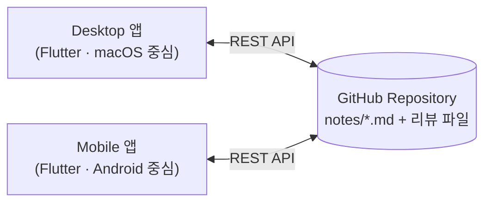
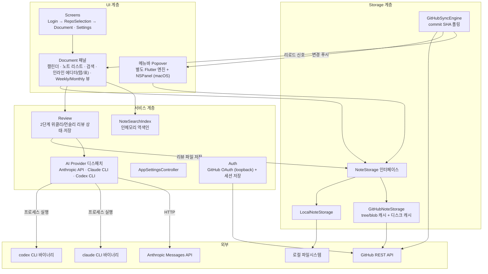
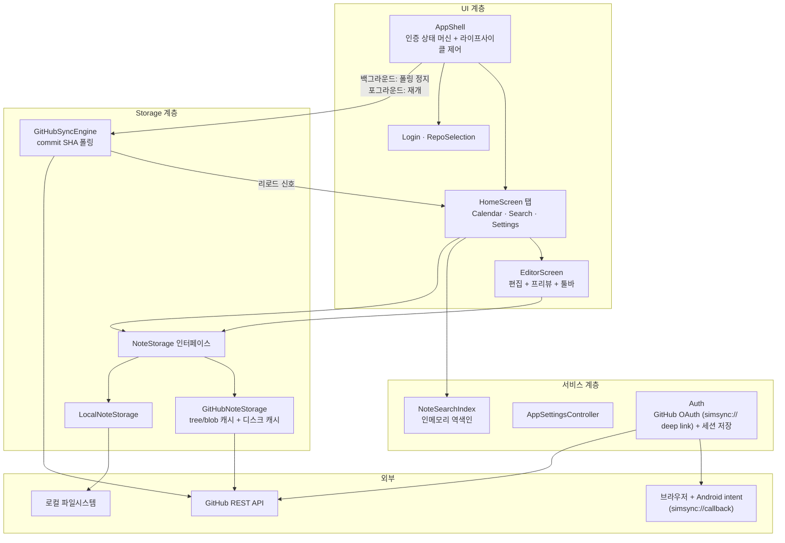
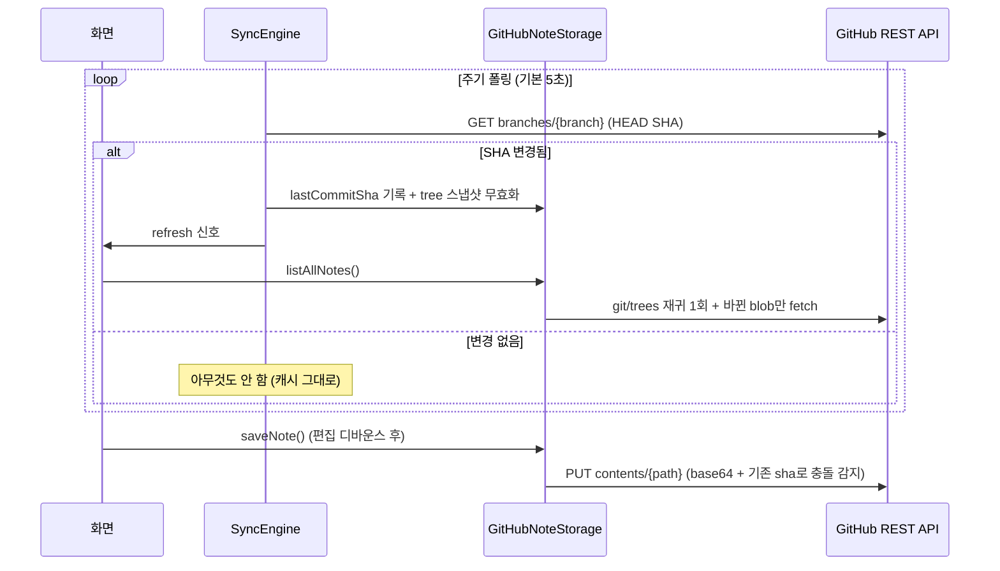

# SimSync Architecture

큰 역할 단위의 컴포넌트 구조를 기록한다. 파일 단위 상세는 코드를 직접 확인한다
([guide.md](guide.md)의 Discovery commands 참고).

기준: `develop` 2026-07-03 (Codex CLI 지원 PR #38, mobile 정리 PR #39 포함).

## 전체 그림

전용 백엔드는 없다. GitHub 저장소가 동기화 저장소이고, 두 Flutter 앱이 각자
GitHub REST API로 직접 통신한다.

- **GitHub 연동은 전부 REST API(HTTP)다.** `git`/`gh` 같은 CLI는 어느 앱도
  사용하지 않는다 (로컬 clone 없음). 사용 endpoint: Contents API(파일 CRUD),
  `git/trees`(재귀 목록), `branches`(HEAD SHA 폴링), OAuth token 교환.
- desktop이 프로세스로 실행하는 외부 CLI는 AI 리뷰용 `claude`/`codex` 두 개뿐이다.

## 공통 구조 패턴 (두 앱 동일)

- **Dual project**: `desktop/`과 `mobile/`은 별도 Flutter 프로젝트. 비즈니스
  로직(models, storage, search)은 복제하고 UI는 플랫폼별로 작성한다.
- **Storage 추상화**: `NoteStorage` 인터페이스 아래 GitHub 구현(동기화 노트)과
  Local 구현(로컬 노트)이 공존하고, 같은 UI에서 함께 다룬다.
- **동기화**: `GitHubSyncEngine`이 branch HEAD commit SHA를 폴링(기본 5초,
  오류 시 지수 백오프). SHA가 바뀌면 tree 스냅샷을 무효화하고 refresh 신호를
  올려 화면이 다시 로드한다. 충돌은 Last-Write-Wins + dirty 노트 보호.
- **캐시**: tree/blob 인메모리 캐시 + repo별 디스크 캐시(`GitHubNoteCache`).
  기록된 lastCommitSha가 HEAD와 같으면 콜드 스타트에 API 호출 0회로 목록을
  서빙한다.
- **상태 관리**: 중앙 컨테이너(Provider/Riverpod) 없이 ChangeNotifier
  (설정/리뷰) + ValueNotifier 신호(refresh) + setState 조합.

## Desktop 아키텍처

| 컴포넌트 | 역할 |
|----------|------|
| Screens / Document 패널 | 캘린더 중심 탐색, 노트 리스트, 검색, 인라인 마크다운 에디터(멀티 탭·표 편집), Weekly/Monthly 저널 뷰 |
| 메뉴바 Popover | 별도 Flutter 엔진을 NSPanel로 띄우는 미니 앱(캘린더+리스트+에디터). 자체 폴링 없이 메인 엔진이 변경을 푸시 |
| Review | 2단계 리뷰(1단계 핵심 정리 체크리스트 → 2단계 최종 리뷰). 생성은 명시적 버튼으로만, 결과는 노트와 분리된 리뷰 파일로 동기화 저장소에 저장 |
| AI Provider | 설정에 따라 Anthropic Messages API(HTTP), `claude --print`(프로세스), `codex exec`(프로세스) 중 하나로 생성 |
| Auth | GitHub OAuth App — 브라우저 → localhost loopback callback → token 교환, 세션은 로컬 파일 저장 |
| Storage | `NoteStorage` 인터페이스에 GitHub 구현(Contents/trees API + 2중 캐시)과 Local 구현(사용자 지정 디렉토리) |
| SyncEngine | HEAD SHA 폴링으로 원격 변경 감지 → 캐시 무효화 + 화면 리로드 신호 |

## Mobile 아키텍처

| 컴포넌트 | 역할 |
|----------|------|
| AppShell | 인증 상태 머신(restoring → login → repo 선택 → home), deep link 수신, 앱 라이프사이클에 따라 폴링/세션 체크 정지·재개 |
| HomeScreen 탭 | Calendar(일별 노트 + 메모 탭) · Search(역색인 검색) · Settings 3탭 구성 |
| EditorScreen | 전체 화면 노트 편집(디바운스 자동 저장, 마크다운 프리뷰) |
| Auth | GitHub OAuth App — 브라우저 → `simsync://callback` custom scheme deep link(app_links) → token 교환 |
| Storage / SyncEngine | desktop과 동일 구조 (구현 복제). 리뷰 파일은 경로 필터로 노트 목록에서 제외 |

desktop과의 큰 차이: AI 리뷰 없음, 멀티 윈도우/메뉴바 없음, 탭 기반 IA,
백그라운드 전환 시 폴링 정지(배터리).

## 외부 연동 정리

| 연동 대상 | 방식 | 사용 앱 | 용도 |
|-----------|------|---------|------|
| GitHub REST API | HTTP (`package:http`) | desktop + mobile | 노트 CRUD(Contents), 목록(`git/trees` 재귀 1회), 변경 감지(`branches` HEAD SHA), repo 생성/목록 |
| GitHub OAuth | HTTP + 브라우저 | desktop + mobile | token 발급 — desktop은 localhost loopback, mobile은 `simsync://callback` deep link |
| Anthropic Messages API | HTTP | desktop | AI 리뷰 생성 (API 키 방식) |
| claude CLI | 프로세스 실행 (`claude --print`, stdin으로 노트 전달) | desktop | AI 리뷰 생성 (구독 방식). 파일/셸 도구 전부 차단 + 빈 임시 디렉토리 격리 |
| codex CLI | 프로세스 실행 (`codex exec`, stdin으로 노트 전달) | desktop | AI 리뷰 생성 (ChatGPT 구독 방식). read-only 샌드박스 + 빈 임시 디렉토리 격리 |
| 로컬 파일시스템 | dart:io | desktop + mobile | 로컬 노트, 세션 파일, repo/노트 디스크 캐시, 설정(SharedPreferences) |

`git`/`gh` CLI는 사용하지 않는다.

## 동기화 흐름 (요약)

